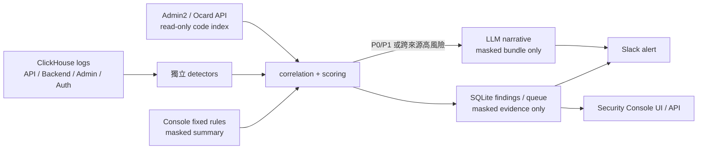

# Security Threat Hunting 移轉與執行計畫

日期：2026-08-06  
目標系統：`ocard-security-console`

## 目標

將後續的主動安全獵捕能力移至 Security Console 內執行。Console 不僅沿用既有固定規則（P0/P1），還必須以 ClickHouse 的 API、Backend、Admin、Auth log 建立獨立判讀能力，補捉固定規則未涵蓋的早期徵兆。

目前不納入 Order API log；但 Backend log 中的 `orderlist/*` 行為仍是重要偵測情境。

## 已完成的基礎

- `GET /api/hunting-summary` 已在 Console `main`，提供給獵捕器使用的去識別化 Console 摘要。
- 摘要 API 僅輸出規則、嚴重度、事件指紋與數值統計；不輸出 IP、帳號、token、headers、params、response 或原始 payload。
- 在分析工作區已完成可移植的安全基礎：HMAC 指紋、SQLite finding state、Console 降級 client、Admin2／Ocard API 端點語意索引原型及其測試。

## 目標架構

## 偵測範圍與獨立標準

| 面向 | 主要訊號 | 觸發判斷 |
|---|---|---|
| API log | endpoint 突增、同來源跨品牌、錯誤比例、罕見 endpoint | 相對 28 日同時段基線、絕對量門檻、品牌覆蓋率 |
| Backend log | `orderlist/delivery` → `orderlist/detail` 序列、`customer/index` 分頁翻閱、敏感資料端點 | 同一來源的 listing/detail 覆蓋、offset 成長、token/資源唯一數（只在記憶體計算） |
| Admin log | 大量／罕見管理操作、跨品牌異常、帳號與來源不一致 | actor/source 指紋、操作頻率、品牌覆蓋與 baseline |
| Auth log | 登入失敗爆量、成功後異常讀取、session／token 使用型態改變 | 成功失敗比、來源分散度、跨 log 關聯 |

判定不依賴 Console 原有 P0/P1。Console 只可提高信心或提供健康資訊；不可用時，獨立證據足夠的事件仍可產生 P1 告警。

## 移轉工作分期

### Phase 1：將安全基礎搬入 Console

1. 在 `src/console/hunting/` 建立 `models.py`、`masking.py`、`store.py`、`console_client.py`。
2. 統一使用 Console 現有 `FP_SECRET`；新增 hunting 專用 domain prefix，避免與 token fingerprint 混用。
3. 擴充 `state/monitor.db`，新增 `hunting_findings`、`hunting_notification_queue`、`hunting_playbook_candidates`、`hunting_run_state`。
4. 所有落盤資料及 Slack／LLM bundle 均強制經 allowlist＋遮罩；不得儲存原始 payload 或可還原識別值。
5. 將分析工作區中的單元測試一併搬入 `tests/test_hunting_*.py`。

驗收：同一 chain upsert 僅增加 hit count；原始 IP、帳號、token 在 SQLite、Slack payload 與測試輸出皆不可出現。

### Phase 2：端點程式語意索引

1. 在設定檔定義 Admin2 與 Ocard API 的唯讀 source root；部署環境以掛載或唯讀 checkout 提供，禁止由 Console 修改來源程式。
2. 解析 CodeIgniter route、controller、method 與內容 hash；只有 revision/hash 變更才重建索引。
3. 對端點標記資料類型（訂單、customer session、身分驗證等）、品牌隔離線索及信心等級。
4. 無法解析時標記 `unknown`，不可憑猜測提高風險分數；高風險且 cache miss 才允許 LLM 讀取已去密的程式片段。

驗收：`orderlist/detail`、`orderlist/delivery`、`customer/index` 與異常 API endpoint 都可連到 controller/method 或明確標示 unknown。

### Phase 3：ClickHouse detectors 與評分

1. 以 15 分鐘 window、6 分鐘 ingestion lag 查詢四種 log；只執行 SELECT。
2. 在 ClickHouse 端完成聚合與唯一數計算；原始 IP／token／帳號只在 process memory 使用，離開 detector 前立即指紋化或丟棄。
3. 實作下列 chain detector：
   - `orderlist/delivery` 後接 `orderlist/detail` 的枚舉鏈。
   - `customer/index` 高 offset／高速翻頁鏈。
   - endpoint burst（單品牌與跨品牌兩視角）。
   - Admin 異常操作、Auth burst 與成功登入後的跨 log 讀取鏈。
4. 評分由 volume、coverage、sequence、端點敏感度、baseline 偏離、Console intelligence 組成；Console 缺席不可降低獨立 P1。
5. 加入歷史情境 fixture：3–7 月 orderlist 大量讀取、Home 燒肉 customer session index 翻閱，以及正常高流量情境。

驗收：歷史 attack fixture 產生預期 chain；正常批次／已核准整合不誤升 P1。

### Phase 4：Slack、LLM 與排程

1. 建立持久化 Slack queue，成功後標記 sent；失敗採指數退避，避免漏告警與重複推送。
2. Slack 只含 severity、端點、指紋、時間窗、數值、跨品牌數與處置連結；不得含可識別資料。
3. LLM 僅在 P0/P1 或跨來源高風險時使用，輸入只可為遮罩 evidence bundle；LLM 失敗不得阻斷 Slack。
4. 將 hunting tick 接入既有 scheduler，固定每 15 分鐘執行；提供 CLI 與 Windows Task Scheduler fallback。
5. 將 Slack webhook 與 LLM key 僅放在 `.env`／Secret Manager，不進 Git、不出現在測試 fixture。

驗收：停用 LLM 時仍會送 Slack；Console 或 LLM 不可用時仍完成 ClickHouse 偵測並記錄 degraded status。

### Phase 5：Console 呈現、Skill 與安全演化

1. 在 Console UI 顯示 hunting finding、chain、端點語意、處理狀態與 degraded health。
2. 建立專案內 skill：`.agents/skills/security-threat-hunting/`，包含查詢約束、證據遮罩、程式碼確認、處置步驟及 replay 格式。
3. 每日根據已遮罩 finding 產生「候選」規則／playbook 改善提案，執行 replay test。
4. 僅人工核准後才更新 `current-playbook.md` 或 detector 設定；禁止由 log 或 LLM 自動改寫偵測規則。

驗收：新規則需通過歷史 replay、正常流量 regression、敏感資料掃描三項測試才可啟用。

## 上線策略

1. Shadow mode（至少 7 日）：落 SQLite、可在 UI 檢視，但不送 Slack。
2. Observe mode：僅 P0/P1 送到 security channel，P2/OBSERVE 留待人工校準。
3. 正式模式：啟用 queue retry、每日健康報告、每週 false positive review。
4. 每次調整門檻或 playbook 前，必須 replay 既有事件與正常尖峰樣本。

## 部署前檢查清單

- [ ] Cloud deployment 已包含 `/api/hunting-summary`。
- [ ] GCP／VM 有唯讀 ClickHouse 認證，且帳號僅具 SELECT 權限。
- [ ] `FP_SECRET`、`SLACK_WEBHOOK_URL`、LLM key 皆由 secret 管理。
- [ ] Admin2／Ocard API source root 為唯讀且版本可識別。
- [ ] `state/`、`outputs/`、`.env` 均在 `.gitignore`。
- [ ] 所有 hunting 測試、遮罩掃描與歷史 replay 通過。
- [ ] Shadow mode 健康觀察完成，告警頻率與值班流程已確認。

## 不做的事

- 不自動封鎖帳號、IP 或 endpoint；本階段僅偵測與告警。
- 不把 Order API log 納入監控面。
- 不把原始 log、payload、token、IP、帳號送到 Slack、LLM 或 SQLite。
- 不讓 LLM 或外部日誌自動修改 skill、規則或 production 設定。
